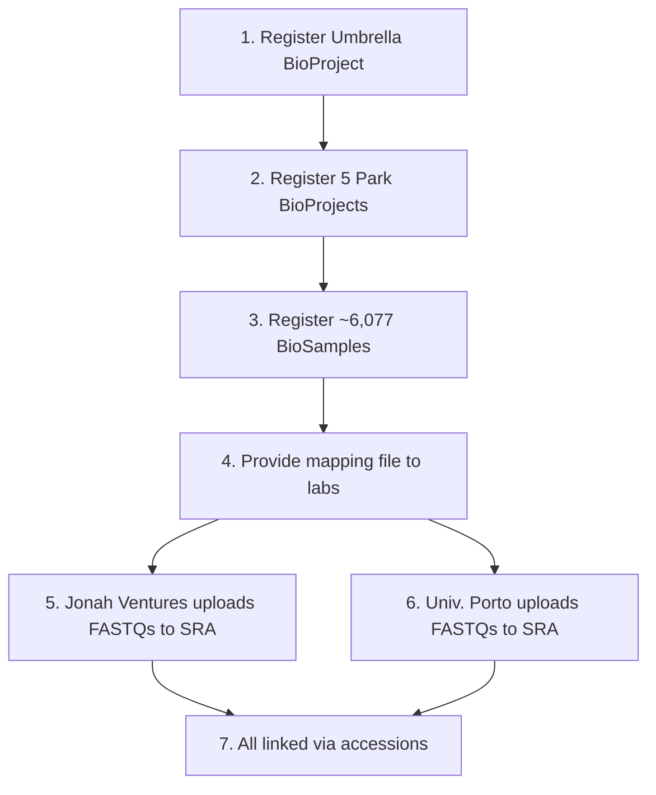

# NCBI Submission Strategy

## Target Databases

| NCBI Resource | What Goes There | Who Submits |
|---|---|---|---|
| **BioProject** (umbrella) | Project-level metadata | African Parks |
| **BioProject** (per park) | Park-level metadata | African Parks |
| **BioSample** | One record per physical sample | African Parks |
| **SRA** | Raw sequence reads (FASTQs) | Jonah Ventures (faecal/soil) · Univ. Porto (water) |

## BioSample Packages

| Sample Type | NCBI Package | Organism Value | NCBI Taxonomy ID |
|---|---|---|---|
| Soil | MIMS.me.soil | "soil metagenome" | 410658 |
| Water | MIMS.me.water | "freshwater metagenome" | 449393 |
| Faecal | MIMS.me.host-associated | "gut metagenome" | 749906 |

## Submission Workflow

