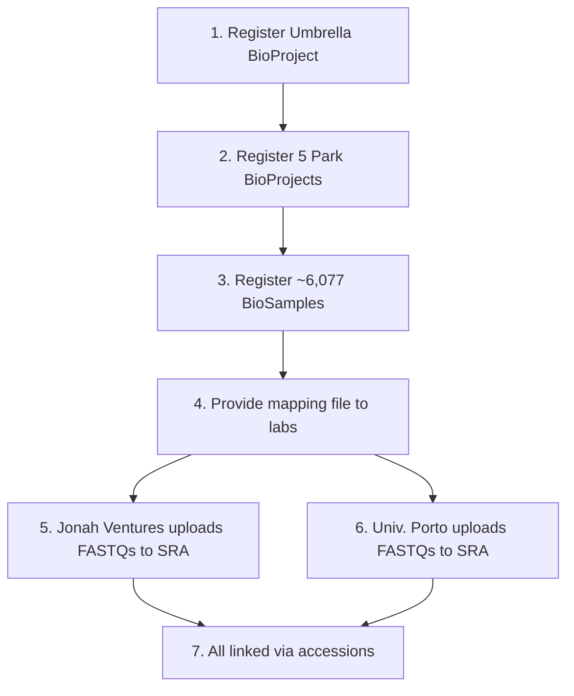

# NCBI Submission Strategy

## Target Databases

| NCBI Resource | What Goes There | Who Submits | Status |
|---|---|---|---|
| **BioProject** (umbrella) | Project-level metadata | African Parks | To be created |
| **BioProject** (per park) | Park-level metadata | African Parks | To be created |
| **BioSample** | One record per physical sample | African Parks | To be created |
| **SRA** | Raw sequence reads (FASTQs) | Jonah Ventures (faecal/soil) · Univ. Porto (water) | Awaiting coordination |

## BioSample Packages

| Sample Type | NCBI Package | Organism Value | NCBI Taxonomy ID |
|---|---|---|---|
| Soil | MIMS.me.soil | "soil metagenome" | 410658 |
| Water | MIMS.me.water | "freshwater metagenome" | 449393 |
| Faecal | MIMS.me.host-associated | "gut metagenome" | 749906 |

## Submission Workflow

### Step 3 Detail: BioSample Registration

The mapping from source data to NCBI BioSample fields:

| NCBI Field | Source | Notes |
|---|---|---|
| `sample_name` | `barcode_id` | Primary identifier |
| `organism` | Determined by sample type | See table above |
| `collection_date` | `date` / `_date` | Normalize to ISO 8601 |
| `geo_loc_name` | `country` + `park_name` | Format: "Country: Park National Park" |
| `lat_lon` | `latitude`, `longitude` | Format: "d.dddd N\|S d.dddd W\|E" |
| `env_broad_scale` | `habitat` → ENVO biome | Park-dependent mapping |
| `env_local_scale` | `habitat` → ENVO local | Direct mapping |
| `env_medium` | `sample_type` → ENVO | Fixed per type |
| `host` | `DNA_species_ID` | Faecal only (REQUIRED) |

## What Can Proceed Now

BioProject and BioSample registration can proceed with current data. The following are available:

- ✅ `sample_name` (barcode_id)
- ✅ `organism` (determined by sample type)
- ✅ `collection_date` (after format normalization)
- ✅ `geo_loc_name` (derivable from country + park)
- ✅ `lat_lon` (derivable from lat/lon coordinates)
- ✅ `host` for faecal (DNA_species_ID)
- 🟡 `env_broad_scale` / `env_local_scale` (need ENVO mapping)

## What's Blocked

SRA submission requires information from the sequencing labs:

| Blocked Item | Needed From | Questions |
|---|---|---|
| Sequencing platform/instrument | Jonah Ventures / Porto | JV Q1–2, Q5–6 |
| Primer sequences | Jonah Ventures / Porto | JV Q3–4 |
| Library layout | Jonah Ventures / Porto | JV Q2, Q6 |
| FASTQ format and mapping | Jonah Ventures / Porto | JV Q15–17 |
