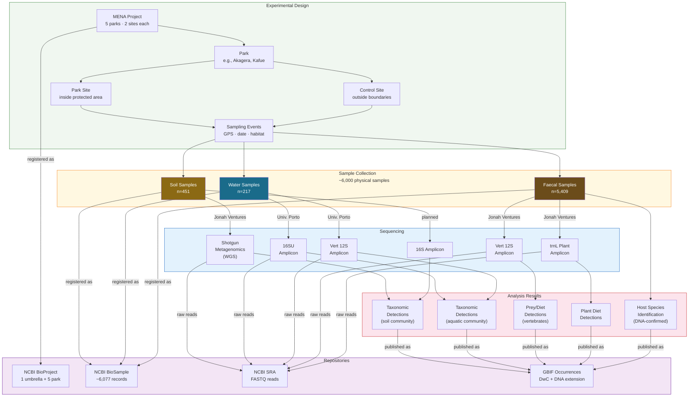

# Conceptual Model

This diagram shows how the MENA experimental design maps to data entities and external repositories.

## Experimental Design → Data Model → Repositories

## Reading the Diagram

**Top to bottom** traces the flow from experimental design through sample collection, sequencing, and analysis to repository publication:

| Data | Repository | Format |
|---|---|---|
| Project structure | NCBI BioProject | Umbrella + 5 child projects |
| Physical samples | NCBI BioSample | 1 record per sample |
| Raw sequence reads | NCBI SRA | FASTQ files linked to BioSamples |
| Taxonomic detections + host IDs | GBIF | Darwin Core occurrences + DNA Derived Data extension |

## Key Design Points

1. **Three sample types, three sequencing strategies.** Soil uses shotgun metagenomics; water and faecal use targeted amplicon. This means the data model must accommodate both WGS and amplicon library strategies.

2. **Two sequencing labs.** Jonah Ventures handles faecal and soil; University of Porto handles water. Both will upload FASTQs to SRA referencing BioSample accessions created by African Parks.

3. **Faecal samples produce two kinds of occurrences.** The host animal (identified by DNA from the dung itself) and the prey/diet species (identified by 12S/trnL from the dung contents). Both are published as GBIF occurrences.

4. **Park × site pairs are the unit of comparison.** Every park has a managed site and an unmanaged control site. This paired design is central to the conservation effectiveness analysis but is not captured by NCBI — it lives in the LinkML schema and GBIF event hierarchy.