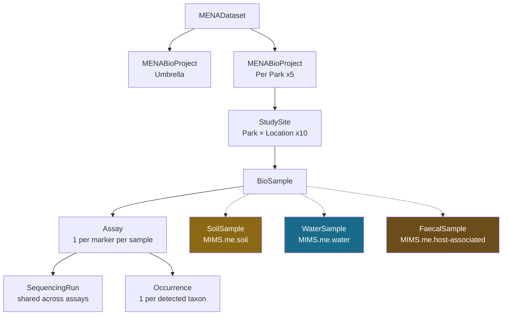

# Entity Model

## Class Hierarchy

## Entity Descriptions

### MENADataset

Root container. Holds the entire project.

### MENABioProject

NCBI BioProject record. One **umbrella** for the whole MENA project, plus one **child** per park.

### StudySite

A park × location_type combination (e.g., "Akagera-park", "Akagera-control"). Ten sites total. Not submitted to NCBI directly but provides organizational structure.

### BioSample (abstract)

One physical sample collected in the field. This is the abstract base class; three subclasses add type-specific fields:

| Subclass | NCBI Package | Organism | Samples |
|---|---|---|---|
| **SoilSample** | MIMS.me.soil | "soil metagenome" (taxid: 410658) | 451 |
| **WaterSample** | MIMS.me.water | "freshwater metagenome" (taxid: 449393) | 217 |
| **FaecalSample** | MIMS.me.host-associated | "gut metagenome" (taxid: 749906) | 5,409 |

### Assay

One assay = one marker (or shotgun library) applied to one sample. Maps to an **SRA Experiment**.

- Faecal samples typically have two assays: 12S vertebrate + trnL
- Water samples have two assays: 16SU + Vertebrate 12S
- Soil samples have one assay: shotgun metagenomics (16S amplicon may follow)

### SequencingRun

A physical run on the sequencing instrument. Maps to an **SRA Run**. Many assays from different samples are multiplexed on one run. Jonah Ventures run IDs follow the pattern `JV327`, `JV339`, etc.

### Occurrence

A single taxon detection from a single assay. Each row in the 12S vertebrate results file maps to one Occurrence. Maps to a **Darwin Core Occurrence** with the **DNA Derived Data extension**.

## Mapping to NCBI

| MENA Entity | NCBI Object | Cardinality |
|---|---|---|
| MENABioProject (umbrella) | Umbrella BioProject | 1 |
| MENABioProject (park) | BioProject | 5 |
| BioSample subclasses | BioSample | ~6,077 |
| Assay | SRA Experiment | ~1–2 per sample |
| SequencingRun | SRA Run | ~40+ runs |

## Mapping to Darwin Core / GBIF

| MENA Entity | DwC Object |
|---|---|
| StudySite | Parent Event (locationID) |
| BioSample | Event + MaterialSample |
| Occurrence | Occurrence |
| Assay fields | DNA Derived Data extension |
