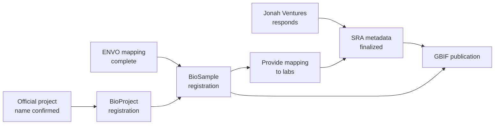

# Project Status

Last updated: February 2026

## Overall Progress

| Milestone | Status | Notes |
|---|---|---|
| Initial data review | ✅ Done | All four source files examined |
| Questions for Jonah Ventures | ✅ Ready to send | 24 questions, prioritized |
| Questions for Univ. Porto | 📝 Drafted | Part of full question set |
| Questions for Jordana / AP | 📝 Drafted | Part of full question set |
| LinkML schema v0.1 | ✅ Draft complete | 10 classes, 99 slots, 9 enums |
| Design document | ✅ Draft complete | Architecture and rationale |
| ENVO habitat mapping | 🔴 Not started | Blocks BioSample submission |
| BioProject registration | ⏳ Waiting | Needs official project name |
| BioSample registration | ⏳ Waiting | Needs ENVO mapping |
| SRA coordination | ⏳ Waiting | Needs Jonah Ventures responses |
| Darwin Core mapping | 📝 Planned | After schema finalized |
| GBIF publication | 📝 Planned | After DwC mapping |
| Protocol registration | 📝 Planned | Recommended |
| Taxonomy validation | 📝 Planned | Recommended |

## Blocking Dependencies

## Schema Versions

| Version | Date | Changes |
|---|---|---|
| 0.1.0 | Feb 2026 | Initial draft with all entities, slots, and enums |
| 0.2.0 | TBD | Incorporate Jonah Ventures responses; add shotgun-specific fields; ENVO mappings |

## Key Decisions Pending

| Decision | Who | Impact |
|---|---|---|
| GBIF license (CC-BY-NC vs CC-BY vs CC0) | AP leadership | All GBIF datasets |
| Coordinate generalization for sensitive species | Jordana + AP security | GBIF publication |
| Official project name | Jordana | BioProject registration |
| Physical sample repository | Jordana | Long-term data linkage |
